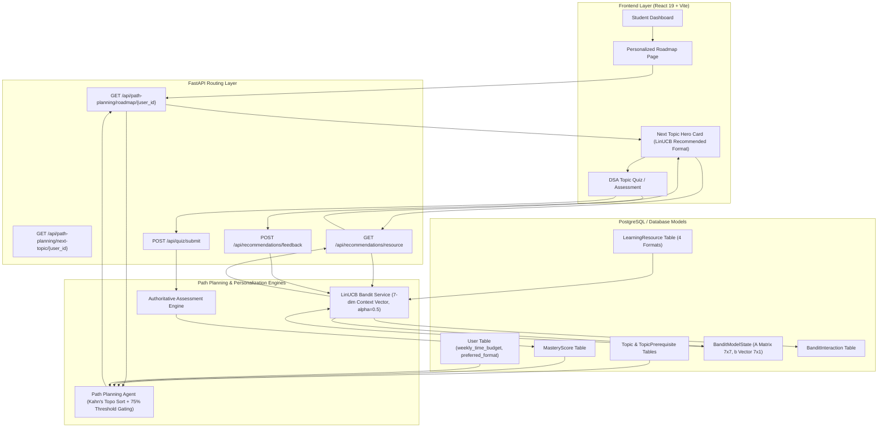
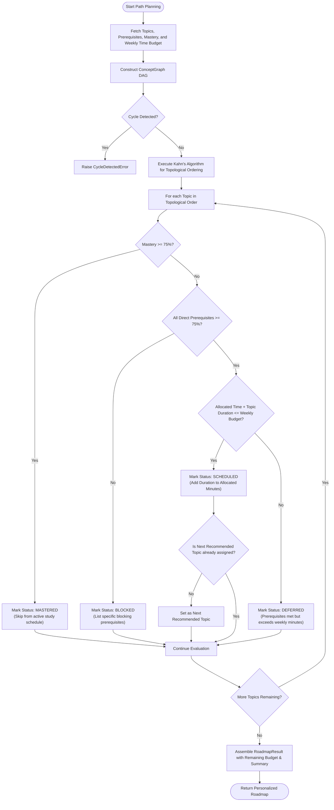
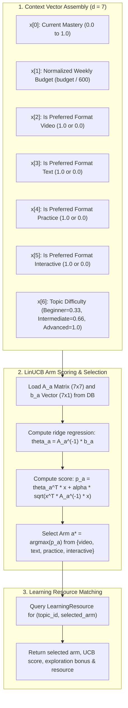
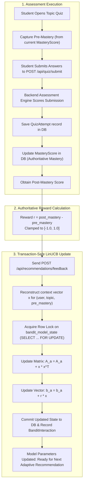
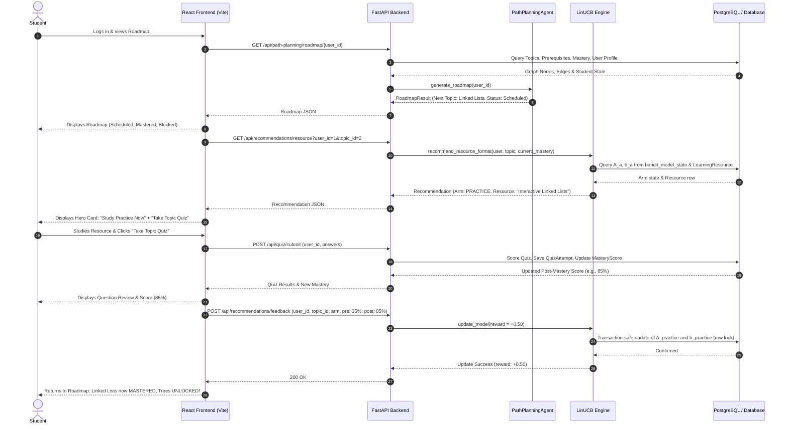
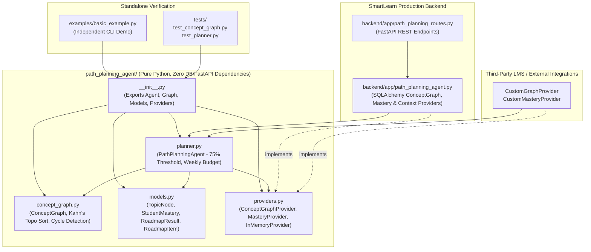

# SmartLearn: Architectural & Process Flowcharts

This document provides formal Mermaid diagrams documenting the architectural, mathematical, and data flows of the **Path Planning Agent**, **CMAB/LinUCB Recommendation Engine**, and **SmartLearn Learning Platform**.

---

## 1. Overall SmartLearn Architecture

---

## 2. Path Planning Algorithm

Answers: **"What should the student learn next?"**

---

## 3. CMAB/LinUCB Recommendation Loop

Answers: **"How should the student learn it?"**

---

## 4. Quiz → Mastery → Reward → Feedback Loop

---

## 5. End-to-End SmartLearn Data Flow

---

## 6. Standalone Path Planning Agent Architecture

